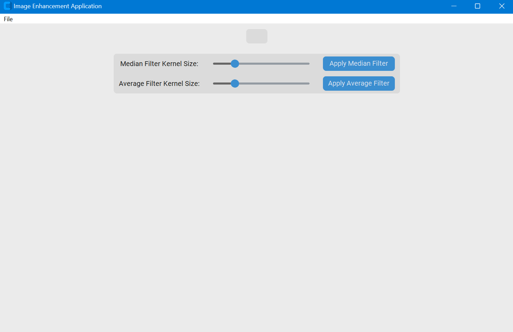
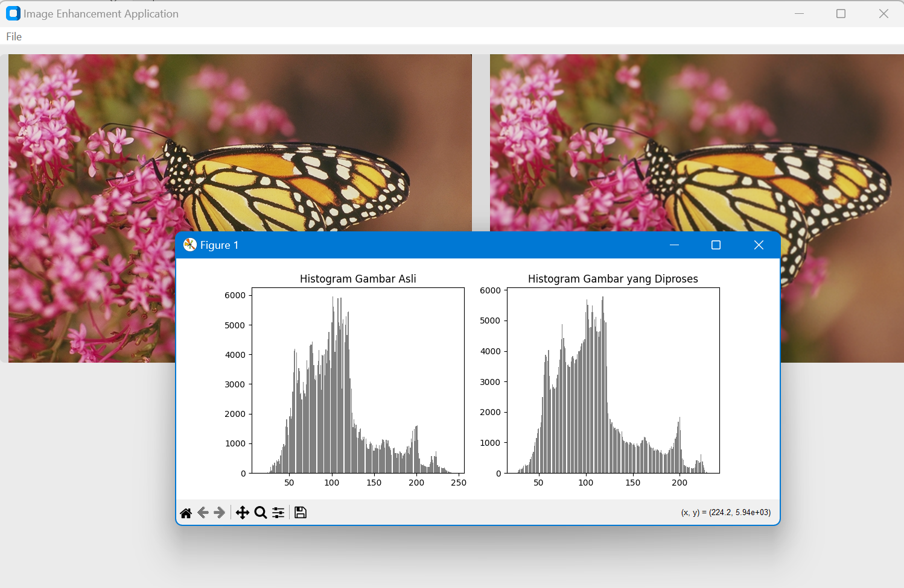

[](https://git.io/typing-svg)

# ✨ Image Enhancement Application 🖼️

[](https://www.python.org/)
[](https://opensource.org/licenses/MIT)
[](https://github.com/your-username/ImageEnhancementApp)

🎉 **Selamat datang di Aplikasi Perbaikan Kualitas Citra!** 🎉  
Aplikasi ini dikembangkan untuk meningkatkan kualitas citra yang terpengaruh oleh noise dengan menggunakan **Filter Median** dan **Filter Rata-rata**.

## 🚀 Fitur Utama
- 📂 **Membuka file gambar** dan menampilkannya dalam tampilan asli.
- 🖥️ **Menerapkan Filter Median** untuk mengurangi noise pada gambar.
- 🎨 **Menerapkan Filter Rata-rata** untuk perbaikan gambar yang halus.
- 💾 **Menyimpan gambar hasil** dengan format `.png`.
- 📊 **Menampilkan histogram** untuk membandingkan gambar asli dan yang telah diproses.

## 📸 Screenshot
**Menu Utama**



**Contoh Perbaikan Citra**



## 🛠️ Cara Instalasi

1. Clone repository ini ke lokal Anda:
   ```bash
   git clone https://github.com/Charelas/Pengolahan-Citra-TI-21-KA-212310041.git
   
2. Masuk ke folder project:
   ```bash
   cd ImageEnhancementApp
   
3. Buat virtual environment dan aktifkan:
   ```bash
   python -m venv venv
   source venv/bin/activate # di Mac/Linux
   venv\Scripts\activate # di Windows
   
4. Install semua dependensi:
   ```bash
   pip install -r requirements.txt

## 💻 Cara Menggunakan 

1. Jalankan aplikasi:
   ```bash
   python ImageEnhancePro.py
   
2. Pilih gambar dari komputer Anda dengan klik File > Open.
3. Gunakan slider untuk mengatur ukuran kernel pada Filter Median dan Filter Rata-rata.
4. Klik tombol Apply untuk menerapkan filter yang diinginkan.
5. Kita bisa menyimpan hasil gambar dengan klik File > Save.

## 🔧 Teknologi yang Digunakan

* Python 3.9: Bahasa pemrograman utama
* CustomTkinter: Untuk tampilan GUI yang modern
* OpenCV: Untuk pengolahan citra
* PIL (Pillow): Untuk memanipulasi gambar
* Matplotlib: Untuk menampilkan histogram


## 👨‍💻 Pengembang
[Visit My GitHub](https://github.com/Charelas) | Github

